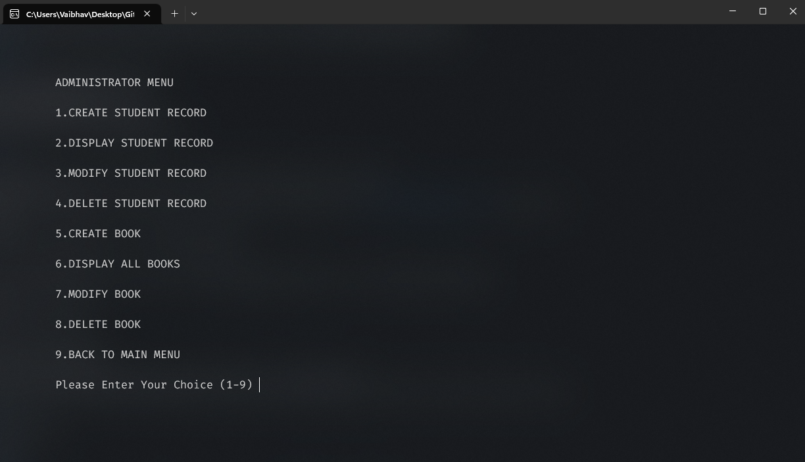
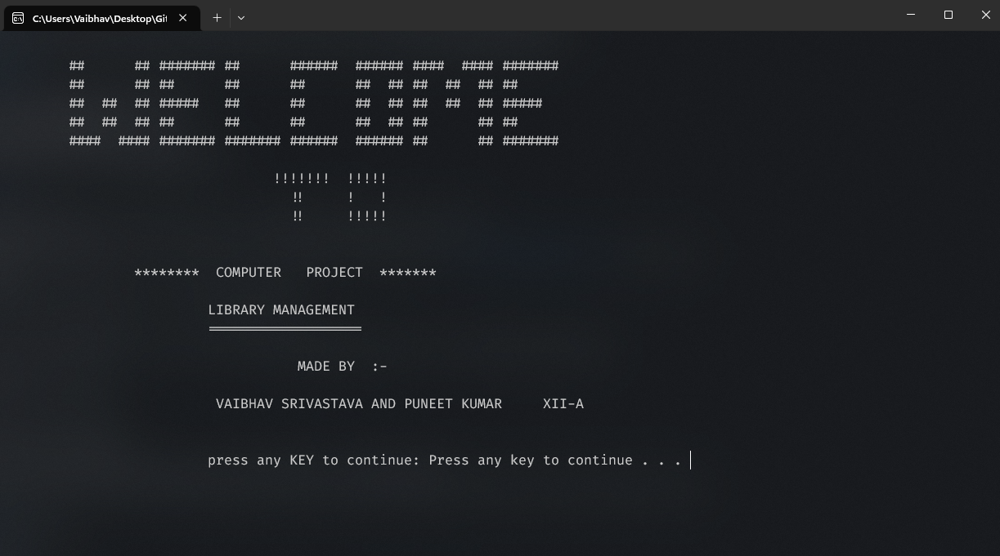
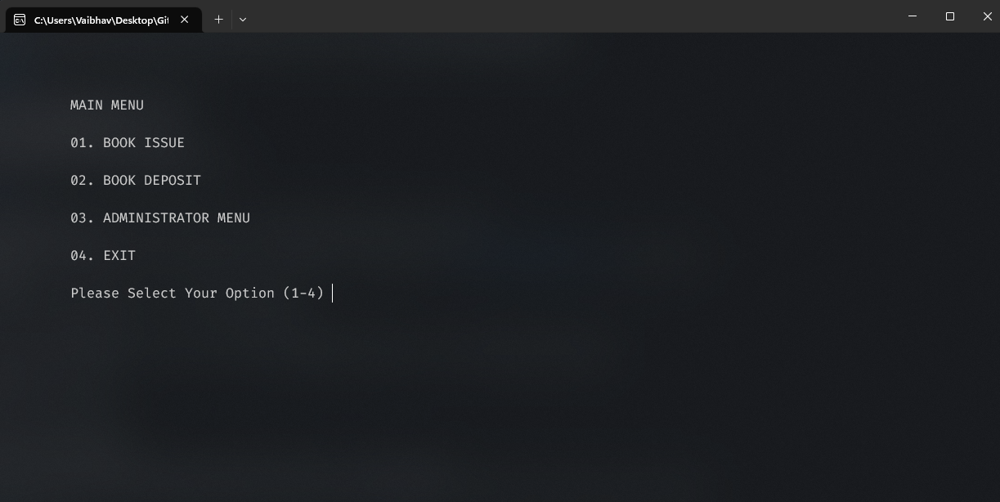

# Library Management System



## Introduction

The Library Management System is a simple C++ console application that allows users to manage books and student records in a library. It provides features for adding, modifying, and deleting student and book records, as well as issuing and depositing books.

## Features

- Create and manage student records.
- Create and manage book records.
- Issue books to students.
- Deposit books back to the library.
- Administrator menu for managing records.

## Usage

1. **Prerequisites**: Ensure you have a C++ compiler installed on your system.

2. **Compile the Code**: Use your preferred C++ compiler to compile the `library_management.cpp` source code.

   ```bash
   g++ library_management.cpp -o library_management
   ```

3. **Run the Application**: To start the Library Management System, run the compiled executable:

   ```bash
    ./library_management
    ```

4. **Administrator Menu**:

    - To access the administrator menu, select option 3 in the main menu.
    - The administrator menu provides options to create, display, modify, and delete student and book records.

## Screenshots




## Author
[Vaibhav Srivastava](https://github.com/ZeusSama0001)

Puneet Kumar

## License
This project is licensed under the MIT License - see the [LICENSE.txt](LICENSE.txt) file for details.

## Acknowledgments
This project was created as part of a computer science project.

Special thanks to our teachers for their guidance and support.
